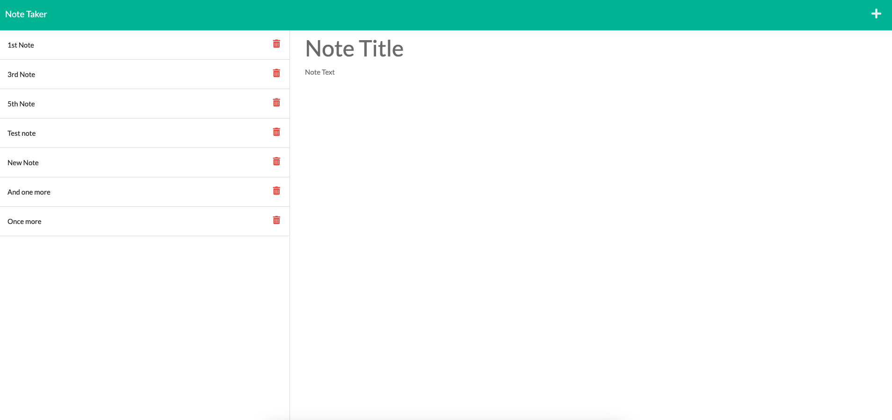

# Note Taker

  

  ## Description
  This project allows a user to create notes and save them to a database, also the notes will persist across browsers. The live version of the project is deployed at https://stark-ridge-83519.herokuapp.com

  

  ## Table of Contents
  - [Installation](#installation)
  - [Usage](#usage)
  - [Credits](#credits)
  - [License](#license)
  - [Contributing](#contributing)
  - [Tests](#tests)
  - [Questions](#questions)

  ## Installation 
  Use git clone to clone the repository on your local machine and then run npm i

  ## Usage 
  run npm start and then open a browser to http/localhost:3001

  ## Credits 
  Sean Craig

  ## License 
  [License MIT](https://opensource.org/licenses/MIT)

  ## Contributing
  Pull requests are welcome. For major changes, please open an issue first to discuss what you would like to change.

  ## Tests
  There are currently no tests for this project

  ## Questions
  If you have any questions about this project please send me an email at seancraig21@gmail.com or reach out to me on Github my username is seanscraig
